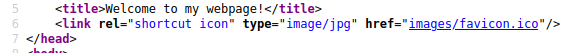

# ▶️ Telnet

## What is Telnet?

Telnet is an application protocol which allows you, with the use of a telnet client, to connect to and execute commands on a remote machine that's hosting a telnet server.

The telnet client will establish a connection with the server. The client will then become a virtual terminal- allowing you to interact with the remote host.

## Replacement

Telnet sends all messages in clear text and has no specific security mechanisms, and for the most part has poor access control. Thus, in many applications and services, Telnet has been replaced by SSH in most implementations.

## How does Telnet work?

The user connects to the server by using the Telnet protocol, which means entering "telnet" into a command prompt. The user then executes commands on the server by using specific Telnet commands in the Telnet prompt. You can connect to a telnet server with the following syntax: `telnet [ip] [port]`

we could use CVEs but there might be misconfiguration

## What is a Reverse Shell?

A "shell" can simply be described as a piece of code or program which can be used to gain code or command execution on a device.

A reverse shell is a type of shell in which the target machine communicates back to the attacking machine.

The attacking machine has a listening port, on which it receives the connection, resulting in code or command execution being achieved.

<figure><figcaption></figcaption></figure>

