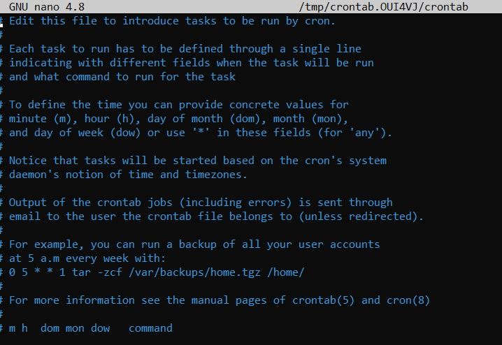

# Content Discovery

## Manual discovery

### **Robots.txt**

The robots.txt file is a document that tells search engines which pages they are and aren't allowed to show on their search engine results or ban specific search engines from crawling the website altogether. It can be common practice to restrict certain website areas so they aren't displayed in search engine results. These pages may be areas such as administration portals or files meant for the website's customers. This file gives us a great list of locations on the website that the owners don't want us to discover as penetration testers.

### Favicon

The favicon is a small icon displayed in the browser's address bar or tab used for branding a website.

<figure><figcaption></figcaption></figure>

Sometimes when frameworks are used to build a website, a favicon that is part of the installation gets leftover, and if the website developer doesn't replace this with a custom one, this can give us a clue on what framework is in use. OWASP host a database of common framework icons that you can use to check against the targets favicon [https://wiki.owasp.org/index.php/OWASP\_favicon\_database](https://wiki.owasp.org/index.php/OWASP\_favicon\_database). Once we know the framework stack, we can use external resources to discover more about it.

<figure><figcaption><p>html element for favicon</p></figcaption></figure>

the following command  will download the favicon and get its md5 hash value which you can then lookup on the [https://wiki.owasp.org/index.php/OWASP\_favicon\_database](https://wiki.owasp.org/index.php/OWASP\_favicon\_database).

`curl https://static-labs.tryhackme.cloud/sites/favicon/images/favicon.ico | md5sum`

on windows powershell:


```powershell
PS C:\> curl https://static-labs.tryhackme.cloud/sites/favicon/images/favicon.ico -UseBasicParsing -o favicon.ico
PS C:\> Get-FileHash .\favicon.ico -Algorithm MD5 
```


### **Sitemap.xml**

Unlike the robots.txt file, which restricts what search engine crawlers can look at, the sitemap.xml file gives a list of every file the website owner wishes to be listed on a search engine. These can sometimes contain areas of the website that are a bit more difficult to navigate to or even list some old webpages that the current site no longer uses but are still working behind the scenes.

### **HTTP Headers**

When we make requests to the web server, the server returns various HTTP headers. These headers can sometimes contain useful information such as the webserver software and possibly the programming/scripting language in use. In the below example, we can see the webserver is NGINX version 1.18.0 and runs PHP version 7.4.3. Using this information, we could find vulnerable versions of software being used. Try running the below curl command against the web server, where the -v switch enables verbose mode, which will output the headers (there might be something interesting!).

```shell-session
 ❯ curl http://10.10.242.96 -v
*   Trying 10.10.242.96:80...
* Connected to 10.10.242.96 (10.10.242.96) port 80 (#0)
> GET / HTTP/1.1
> Host: 10.10.242.96
> User-Agent: curl/7.81.0
> Accept: */*
>
* Mark bundle as not supporting multiuse
< HTTP/1.1 200 OK
< Server: nginx/1.18.0 (Ubuntu)
< Date: Sun, 01 Sep 2024 17:39:24 GMT
< Content-Type: text/html; charset=UTF-8
< Transfer-Encoding: chunked
< Connection: keep-alive
< X-FLAG: THM{HEADER_FLAG}
<
<!DOCTYPE html>
...
```

### **Framework Stack**

Once you've established the framework of a website, either from the above favicon example or by looking for clues in the page source such as comments, copyright notices or credits, you can then locate the framework's website. From there, we can learn more about the software and other information, possibly leading to more content we can discover.


## OSINT (Open-Source Intelligence)

### **Google Hacking / Dorking**

Google hacking / Dorking utilizes Google's advanced search engine features, which allow you to pick out custom content. You can, for instance, pick out results from a certain domain name using the **site:** filter, for example (site:[tryhackme.com](http://tryhackme.com/)) you can then match this up with certain search terms, say, for example, the word admin (site:tryhackme.com admin) this then would only return results from the [tryhackme.com](http://tryhackme.com/) website which contain the word admin in its content. You can combine multiple filters as well. Here is an example of more filters you can use:

<table data-header-hidden><thead><tr><th width="140"></th><th width="191"></th><th></th></tr></thead><tbody><tr><td>Filter<br></td><td>Example<br></td><td>Description<br></td></tr><tr><td>site<br></td><td>site:tryhackme.com<br></td><td>returns results only from the specified website address<br></td></tr><tr><td>inurl<br></td><td>inurl:admin<br></td><td>returns results that have the specified word in the URL<br></td></tr><tr><td>filetype<br></td><td>filetype:pdf<br></td><td>returns results which are a particular file extension<br></td></tr><tr><td>intitle<br></td><td>intitle:admin<br></td><td>returns results that contain the specified word in the title<br></td></tr></tbody></table>

More information about google hacking can be found here: [https://en.wikipedia.org/wiki/Google\_hacking](https://en.wikipedia.org/wiki/Google\_hacking)

### **Wappalyzer**

Wappalyzer ([https://www.wappalyzer.com/](https://www.wappalyzer.com/)) is an online tool and browser extension that helps identify what technologies a website uses, such as frameworks, Content Management Systems (CMS), payment processors and much more, and it can even find version numbers as well.

### **Wayback Machine**

The Wayback Machine ([https://archive.org/web/](https://archive.org/web/)) is a historical archive of websites that dates back to the late 90s. You can search a domain name, and it will show you all the times the service scraped the web page and saved the contents. This service can help uncover old pages that may still be active on the current website.

### **GitHub**

You can use GitHub's search feature to look for company names or website names to try and locate repositories belonging to your target. Once discovered, you may have access to source code, passwords or other content that you hadn't yet found.

### **S3 Buckets**

S3 Buckets are a storage service provided by Amazon AWS, allowing people to save files and even static website content in the cloud accessible over HTTP and HTTPS. The owner of the files can set access permissions to either make files public, private and even writable. Sometimes these access permissions are incorrectly set and inadvertently allow access to files that shouldn't be available to the public. The format of the S3 buckets is http(s)://**{name}.**[**s3.amazonaws.com**](http://s3.amazonaws.com/) where {name} is decided by the owner, such as [tryhackme-assets.s3.amazonaws.com](http://tryhackme-assets.s3.amazonaws.com/). S3 buckets can be discovered in many ways, such as finding the URLs in the website's page source, GitHub repositories, or even automating the process. One common automation method is by using the company name followed by common terms such as **{name}**-assets, **{name}**-www, **{name}**-public, **{name}**-private, etc.


## Automated Discovery

### **Automation Tools**

Although there are many different content discovery tools available, all with their features and flaws, we're going to cover three which are preinstalled on our attack box, ffuf, dirb and gobuster.

#### **Using ffuf:**


```shell-session
user@machine$ ffuf -w /usr/share/wordlists/SecLists/Discovery/Web-Content/common.txt -u http://10.10.242.96/FUZZ
```


#### Using dirb:


```shell-session
user@machine$ dirb http://10.10.242.96/ /usr/share/wordlists/SecLists/Discovery/Web-Content/common.txt
```


#### Using Gobuster:


```shell-session
user@machine$ gobuster dir --url http://10.10.242.96/ -w /usr/share/wordlists/SecLists/Discovery/Web-Content/common.txt
```

